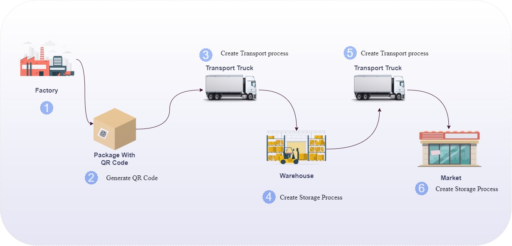
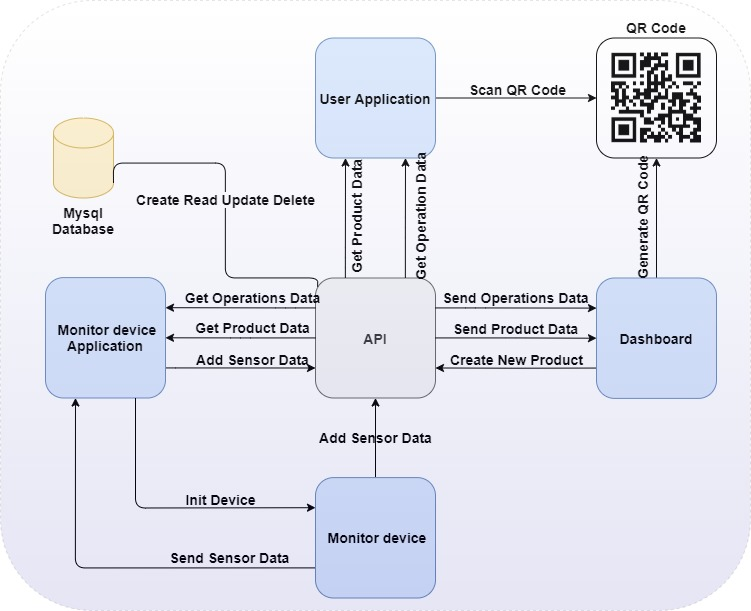

# Storage_guard

## Description:

The project aims to develop a device for monitoring the conditions surrounding stored and transported goods throughout the supply chain. This is done to ensure user protection from spoiled products such as medicines and food. The methodology followed in this project consists of three main steps.
### Project scenario

This diagram shows the scenario of this project

* Step 1: This step involves the production of the product and the installation of a label containing a Quick Response (QR) code on the box that contains the product or on the product itself, depending on the distribution method. This code contains a link that provides information about the product, including its type, manufacturer, specifications, and the environmental conditions.

* Step 2: This step involves the transportation and storage of the products. In this step, all the QR codes are read, and these products are connected to a device that monitors the temperature and humidity surrounding them. This information is stored in the product-related database.

* Step 3: This step involves the customer. When the customer comes to the store, they can open their mobile phone and scan the QR code of the product they wish to purchase. Through this code, the customer can know how the product has been stored, transported, and whether it is safe for human consumption.

Regarding the tools used in this project, we will be using ESP32, DHT11, OLED 0.96, in addition to several other device-related components. In terms of software, we have developed a consumer application, a device user application, and a backend application for storage and process linking.

### Block diagram

This Block diagram of the project

## Tools Used

- Flutter: Flutter was used to build the user app, client app, and dashboard. It is a powerful framework for developing cross-platform mobile applications.

- Laravel: Laravel was used for building the backend of the project. It is a PHP framework known for its elegance and robustness in web development.

- EasyEDA: EasyEDA was used to design the circuit for the project. It is a web-based tool that provides an easy-to-use interface for designing electronic circuits.

- SketchUp: SketchUp was used for designing the 3D package. It is a 3D modeling software that allows you to create and modify 3D designs with ease.

- Figma: Figma was used to design the UI for the project. It is a collaborative design tool that enables teams to create, prototype, and collaborate on user interfaces.

## UI Design
You can view the UI design for this project on Figma. Click [here](https://www.figma.com/file/PbwwBlaESeXXwpQmey9ZeX/Storage-Guard?type=design&node-id=106%3A343&mode=design&t=6I2FvKPpFj7dOu3u-1) to access the design.

## Test Video 
https://github.com/ma21alsaeed/Storage_guard/assets/58627845/a06ad6d3-7e32-43df-9e11-e37e53a8593a
